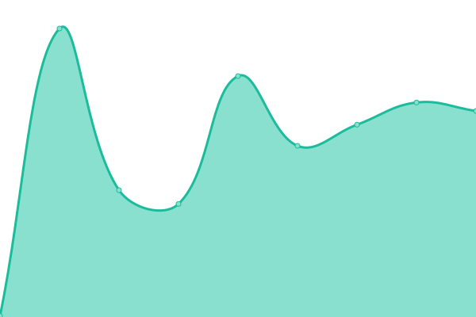
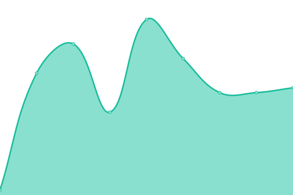

# [📈 Live Status](https://demo.upptime.js.org): <!--live status--> **🟧 Partial outage**

This repository contains the open-source uptime monitor and status page for [Haydn Diniz](https://demo.upptime.js.org), powered by [Upptime](https://github.com/upptime/upptime).

<!--start: status pages-->
<!-- This summary is generated by Upptime (https://github.com/upptime/upptime) -->
<!-- Do not edit this manually, your changes will be overwritten -->
<!-- prettier-ignore -->
| URL | Status | History | Response Time | Uptime |
| --- | ------ | ------- | ------------- | ------ |
|  [Haydndiniz.dev](https://haydndiniz.dev) | 🟩 Up | [haydndiniz-dev.yml](https://github.com/Haydndiniz/upptime/commits/HEAD/history/haydndiniz-dev.yml) | 

 142ms
     
 | 

<a href="https://uptime.haydndiniz.dev/history/haydndiniz-dev">100.00%</a>
    

|  [WD NAS - Photo Server](https://news.ycombinator.com) | 🟩 Up | [wd-nas-photo-server.yml](https://github.com/Haydndiniz/upptime/commits/HEAD/history/wd-nas-photo-server.yml) | 

 315ms
     
 | 

<a href="https://uptime.haydndiniz.dev/history/wd-nas-photo-server">100.00%</a>
    

|  [WD NAS - Project Blog](https://thissitedoesnotexist.koj.co) | 🟥 Down | [wd-nas-project-blog.yml](https://github.com/Haydndiniz/upptime/commits/HEAD/history/wd-nas-project-blog.yml) | 

 0ms
     
 | 

<a href="https://uptime.haydndiniz.dev/history/wd-nas-project-blog">95.77%</a>
    

|  [Homeassistant](https://haydndiniz.dev) | 🟩 Up | [homeassistant.yml](https://github.com/Haydndiniz/upptime/commits/HEAD/history/homeassistant.yml) | 

 49ms
     
 | 

<a href="https://uptime.haydndiniz.dev/history/homeassistant">100.00%</a>
    

<!--end: status pages-->

[**Visit our status website →**](https://demo.upptime.js.org)

## 📄 License

- Powered by: [Upptime](https://github.com/upptime/upptime)
- Code: [MIT](./LICENSE) © [Haydn Diniz](https://demo.upptime.js.org)
- Data in the `./history` directory: [Open Database License](https://opendatacommons.org/licenses/odbl/1-0/)
